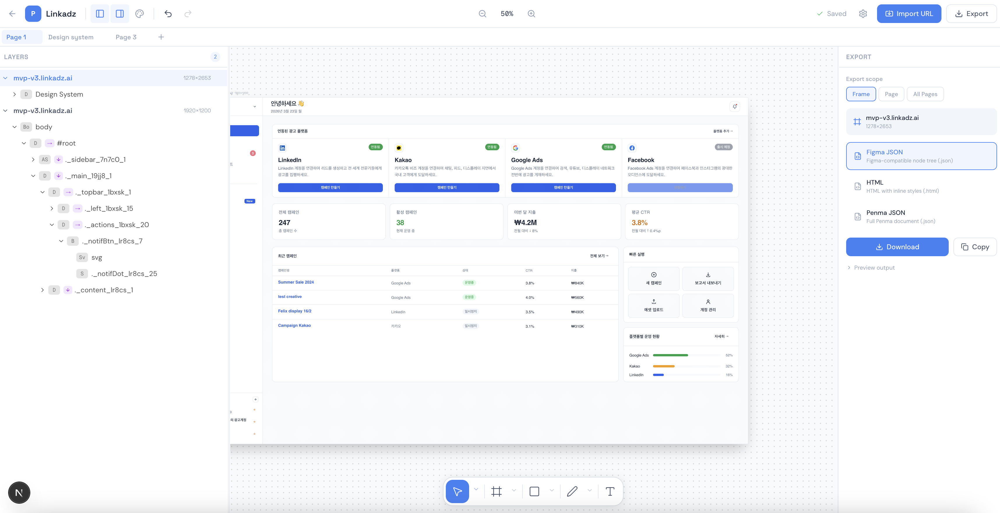

# Penma

**The design editor for the AI coding era.**

Software design is changing. The old workflow was **Figma -> prototype -> code** — designers drew every screen by hand, then developers translated pixels into production code.

The new workflow is **Claude Code -> code** — AI generates production-ready UI directly. But there's a gap: you still need to inspect, tweak, and polish the output visually. That's where Penma comes in.

Penma imports any web page — whether built by Claude Code, hand-coded, or live in production — and turns it into a fully editable design on an infinite canvas.



## Why Penma

- **Bridge the AI-to-design gap.** Claude Code generates your UI. Penma lets you visually inspect and refine it without touching code.
- **Import any URL or HTML.** Paste a URL or upload a ZIP of HTML files. Penma captures the full DOM — styles, layout, assets, CSS classes — and makes every element editable.
- **Extract the design system.** Colors, typography, spacing, and radii are auto-detected from the imported code. See exactly what Claude Code produced.
- **Export to Figma.** Generate Figma-compatible JSON with auto layout, components, and design tokens preserved — for teams that still need design files.
- **Compare layouts side by side.** Import the same page at Desktop, Tablet, and Mobile on one canvas.

## The workflow

```
Claude Code  ->  generates UI code  ->  deploy / preview
                                            |
                                      Penma imports it
                                            |
                                    inspect, edit, refine
                                            |
                                  export (Figma / HTML / CSS)
```

1. **Build with Claude Code** — AI writes your components, pages, and styles.
2. **Import into Penma** — Paste the URL or upload the HTML. Penma captures everything: DOM structure, computed styles, original CSS classes, fonts, and assets.
3. **Edit visually** — Select any element, change styles, edit text, resize, reposition. Full undo/redo.
4. **Export** — Download as Figma JSON, HTML, or extract the design system for documentation.

## Key features

**Canvas** — Infinite pan & zoom, multi-frame workspace, dot-grid background, frame resize handles.

**Import** — URL import via headless browser, ZIP upload for local HTML files. 5 screen presets + custom sizes, real-time progress, CSS classes and original stylesheet rules stored in database for inspection.

**Editing** — Inline text editing, drag-to-move, resize handles, full CSS inspector, Figma-style Auto Layout (direction, gap, padding, alignment, sizing), position & constraints panel, undo/redo history.

**Panels** — Layer tree with expand/collapse and right-click context menu, Layout panel with auto layout toggle, Position panel with alignment & constraints, Fill & Stroke editors, Original CSS panel showing per-class declarations, Design System tab (colors, typography, spacing, radii).

**Export** — Figma JSON with auto layout, components, absolute positioning, and image/SVG references. HTML and Penma JSON formats.

## Getting started

```bash
pnpm install
pnpm dev
```

Open [http://localhost:3000](http://localhost:3000) and import any URL.

## Tech stack

- **Next.js 15** (App Router) + TypeScript + Tailwind CSS 4
- **Zustand** + Immer for state management with patch-based undo/redo
- **Puppeteer** for server-side URL import
- **MongoDB** for storing projects, imported CSS, and fonts

## License

MIT
